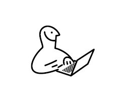
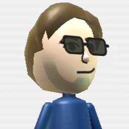
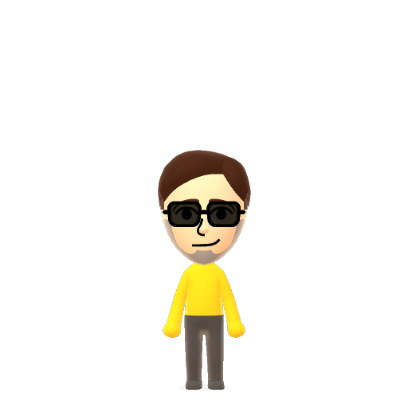

# TheDude53's PFP Collection
Note: Dates may not be perfectly accurate.

## IKEA Guy
Created: November 1st, 2018  
Taken from an [IKEA instructions manual](https://web.archive.org/web/20170222003748/http://www.ikea.com/us/en/manuals/eket-cabinet-with-door__AA-1902820-1.pdf), this picture was first seen on TheDude53's Discord account.

  

## Original Mii
Created: November 5th, 2020  
Made using a Wii emulator, this picture was originally made "just for fun". Eventually this became the profile picture for services that use Gravatar.

## Original Mii (Mr. Beast)
Created: January 27th, 2021  
While playing Wii Play, TheDude53 noticed how closely the Mii render resembled Mr. Beast's profile picture.

## Reddit Snoo
Created: February 13th, 2021  
Almost immediately after he heard about Reddit's custom Snoo feature, he made himself as a Snoo.

## Remastered Mii
Created: February 14th, 2021  
After discovering Nintendo's online Mii Studio, TheDude53 recreated his Mii.

  

## Picrew
Created: September 29th, 2021  
While exploring profile picture creators with friends, TheDude53 found Picrew. Needless to say, he made himself. Or as close as he could get.

